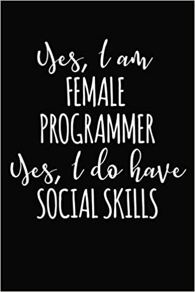

### Hi there 👋🏽
✨I'm Stacey✨. senior project manager --> web developer
- Pronouns: she/her 😊
- I’m currently working on my portfolio 👩🏽‍💻
-  I’m currently learning: JavaScript, HTML, CSS, React.Js, Node.js, Express, MongoDB and Bootstrap 👓

<!--  -->

### Languages 🗣
   

  

  

### Frameworks 💻
 

 

### Tools
  

 

### Services
  

###  Click to connect with me 🤝🏽

  

 

  

<!--
**staceyjo/STACEYJO** is a ✨ _special_ ✨ repository because its `README.md` (this file) appears on your GitHub profile.

<!-- Here are some ideas to get you started:

- 👯 I’m looking to collaborate on ...
- 🤔 I’m looking for help with ...
- ⚡ Fun fact: ... -->

